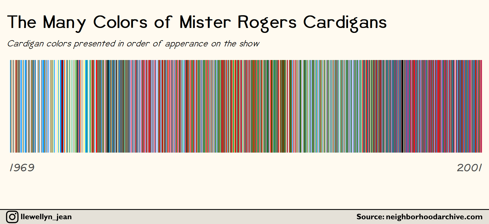

# Rogers-Cardigans

MrRogers.R details the method for scrapping neighborhoodarchive.com to retreive the color of every sweater Rogers wore in episodes that aired from 1979 to 2001

Exact data was pulled from wayback machine: https://web.archive.org/web/20110525014454/http://neighborhoodarchive.blogspot.com/2011/05/sweater-colors.html 

## Update 4/10/2020 

AnalysisWillFullData.R includes the code for visualizing the full dataset of cardigan colors (stored in cardigancolors.csv). Colors were collected manually from [each episode](http://www.neighborhoodarchive.com/mrn/episodes/) and should be considered to be (at best) approximate matches. 

